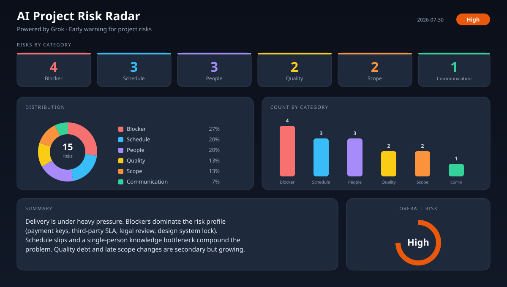

# AI Project Risk Radar

I got tired of finding out about project problems *after* they already cost a sprint.

Blockers sitting quiet for two weeks. One person owning three critical tickets. New scope landing with no estimate. Nobody was “ignoring” risk — there was just too much noise to scan every day.

So I built a small system that reads GitHub issues/PRs on a schedule, asks an LLM what’s actually worrying, and dumps the result into a dashboard I can open in 10 seconds.

Not a full PM platform. Just an early-warning layer.

[](https://github.com/features/actions)
[](https://x.ai)
[](https://raw.githack.com/rpriyaprakasm-bit/ai-project-risk-radar/main/docs/index.html)

---

## Dashboard (what it looks like)



**Open the live version:**  
→ [Interactive dashboard](https://raw.githack.com/rpriyaprakasm-bit/ai-project-risk-radar/main/docs/index.html)

(GitHub Pages permanent URL once enabled: `https://rpriyaprakasm-bit.github.io/ai-project-risk-radar/`)

---

## What it actually does

1. Collects open issues + PRs from GitHub (falls back to demo data if the repo is empty — useful for portfolio demos)
2. Sends a structured prompt to **Grok** (or Claude if you prefer)
3. Writes:
   - a Risk Report as a GitHub Issue
   - `risk_report.json`
   - an HTML dashboard with category tiles, pie, bars, and action cards

### Categories it looks for

| Category | Rough idea |
|----------|------------|
| Blocker | Stuck work, external dependencies, “waiting on…” |
| Schedule | Missed due dates, overloaded sprints |
| People | Bus factor, missing coverage, access delays |
| Quality | Flaky tests, error spikes |
| Scope | Unestimated or late-arriving work |
| Communication | Silent PRs / stale updates |

I tried a pure **severity** view (Critical / High / Medium / Low) first. It was accurate but harder to act on in a standup. Category view won — PMs ask “what kind of problem?” before “how red is it?”

---

## How to run it

### Grok (default)

1. Repo **Settings → Secrets → Actions**
2. Add `XAI_API_KEY` from [console.x.ai](https://console.x.ai)  
   *(needs credits — empty balance returns 403)*
3. **Actions → AI Project Risk Radar (Grok) → Run workflow**

### Claude (optional)

Same flow with `ANTHROPIC_API_KEY` and the Claude workflow.

### GitHub Pages (one-time)

1. **Settings → Pages → Source → GitHub Actions**
2. Run the **Deploy Dashboard** workflow (or push again)

---

## What’s real vs demo

Right now the dashboard ships with **rich demo risks** so the graphs aren’t empty on a fresh fork. When the collector finds real issues, those replace the sample set.

If you fork this and only see demo data: that’s expected until the workflow runs against a repo with actual tickets.

---

## Limitations (honest)

- **GitHub only** for data today. Jira / Linear / Notion are stubs — same collector interface, not wired up yet.
- **LLM judgment isn’t perfect.** It can over-rank noisy tickets or miss context that only exists in Slack.
- **Needs API credits.** Without an `XAI_API_KEY` balance the Grok workflow fails hard.
- **Dashboard is static HTML** after each run. No live websocket; refresh after the Action finishes.
- **Pages setup is still manual** (GitHub requires you to click Source = Actions once).
- I haven’t battle-tested this on a 500-issue monorepo. It was built for small–medium project boards.

More detail: [LIMITATIONS.md](LIMITATIONS.md)

---

## Still on my list

- [ ] Wire a real Jira collector (even read-only)
- [ ] Filter “noise” labels so chores don’t look like blockers
- [ ] Weekly trend line (risk count over the last N runs)
- [ ] Slack/email ping when overall risk jumps to Critical
- [ ] Tighten the prompt so evidence quotes issue numbers more consistently

---

## Layout of the repo

```text
.github/workflows/     Grok + Claude + Pages deploy
src/collectors/        GitHub first; others stubbed
src/analyzers/         Grok / Claude prompts + parsing
src/reporters/         Issue + JSON writers
docs/                  Dashboard + snapshot + sample JSON
prompts/               Prompt templates I iterate on
```

---

## About AI use on this project

I used Grok heavily for scaffolding the dashboard HTML, workflow YAML, and first-pass analyzer code.  
**I chose the problem, the category model, the demo scenarios, and when to throw away the severity-first UI.**

If you’re reviewing this as a portfolio piece: ask me why blockers sit above scope, or how I’d plug in Linear — that’s the part that isn’t generated.

---

## License

MIT — use it, break it, improve it.
